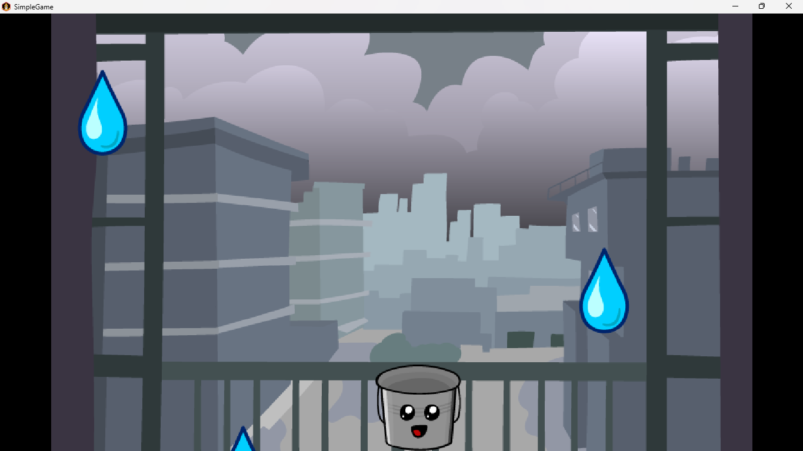

# Simple Water Droplet Game

A simple 2D arcade-style game built with **Java** and **LibGDX**. Control a bucket to catch falling raindrops while avoiding missed drops. Missing even one drop ends the game.

## Features

* Keyboard and touch controls
* Randomly spawning raindrops
* Bucket movement and collision detection
* Sound effects when catching drops
* Background music
* Game Over screen when a drop is missed
* Responsive viewport scaling using FitViewport

## Technologies Used

* Java
* LibGDX

## Gameplay

Move the bucket left and right to catch falling raindrops. Each caught drop plays a sound effect. If a raindrop reaches the bottom of the screen, the game ends immediately.

## Controls

| Key         | Action      |
| ----------- | ----------- |
| ←           | Move Left   |
| →           | Move Right  |
| Mouse/Touch | Move Bucket |


## Project Structure

```text
assets/
├── background.png
├── bucket.png
├── drop.png
├── music.mp3
└── drop.mp3
```

## Installation

1. Clone the repository

```bash
git clone https://github.com/yourusername/rain-catcher-game.git
```

2. Open the project in IntelliJ IDEA.

3. Run the desktop launcher.

## Learning Outcomes

This project demonstrates:

* Game loop implementation
* Sprite rendering
* Collision detection using Rectangle
* Audio integration
* User input handling
* Viewport management
* Basic game state management

## Running the Game

### Build the JAR

From the project root directory:

```bash
gradlew lwjgl3:dist
```

### Locate the JAR

After the build completes, the runnable JAR will be generated in:

```text
lwjgl3/build/libs/
```

### Run the Game

Using the command line:

```bash
java -jar your-game-name.jar
```

Or simply double-click the generated JAR file.

### Requirements

* Java JDK installed
* Windows, Linux, or macOS

### Screenshot




## License

This project is open-source and available under the MIT License.
